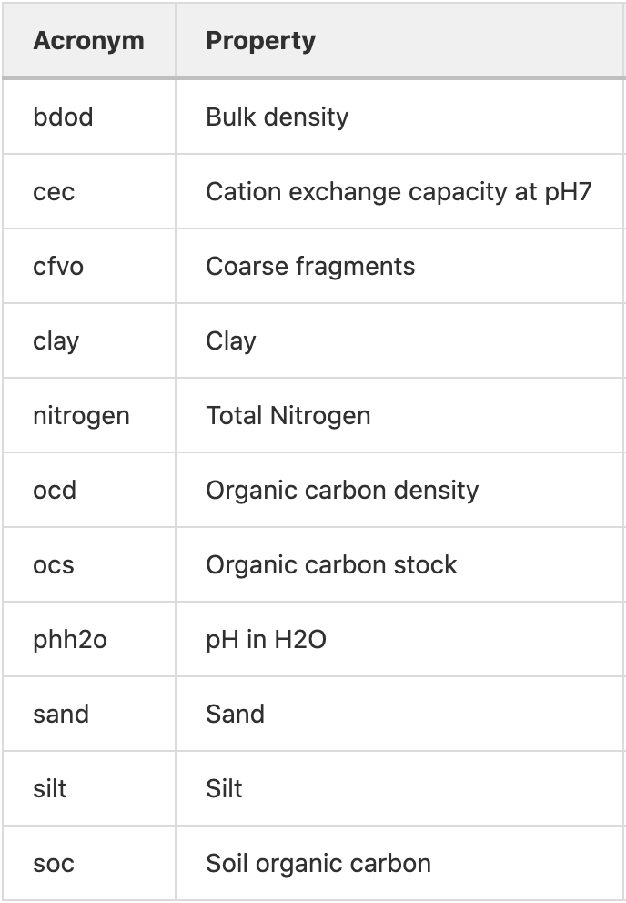

# CNN-RNN-Yield-Prediction


This repository contains codes for the paper entitled <a href="https://www.frontiersin.org/articles/10.3389/fpls.2019.01750/full" target="_blank">"A CNN-RNN Framework for Crop Yield Prediction"</a> published in Frontiers in Plant Science Journal. The paper was authored by Saeed Khaki, Lizhi Wang, and Sotirios Archontoulis. In this paper, we proposed a framework for crop yield prediction.


### We spend a lot of time gathering and cleaning data from different publicly available sources (~300GB) and now we are sharing the final ready-to-use CSV file with you . Please cite our papers which are all related to crop yield prediction if you use our data or codes. Thanks!


## Downloading the Data

### To get the download link for of the full data and just for academic purposes (Non-commercial), please send your requset to the following email:

skhaki@iastate.edu


```
@article{Khaki_2020,
   title={A CNN-RNN Framework for Crop Yield Prediction},
   volume={10},
   ISSN={1664-462X},
   url={http://dx.doi.org/10.3389/fpls.2019.01750},
   DOI={10.3389/fpls.2019.01750},
   journal={Frontiers in Plant Science},
   publisher={Frontiers Media SA},
   author={Khaki, Saeed and Wang, Lizhi and Archontoulis, Sotirios V.},
   year={2020},
   month={Jan}
}


@article{khaki2019crop,
  title={Crop yield prediction using deep neural networks},
  author={Khaki, Saeed and Wang, Lizhi},
  journal={Frontiers in plant science},
  volume={10},
  year={2019},
  publisher={Frontiers Media SA}
}

@article{khaki2020predicting, title={Predicting yield performance of parents in plant breeding: 
A neural collaborative filtering approach}, 
author={Khaki, Saeed and Khalilzadeh, Zahra and Wang, Lizhi},
journal={Plos one}, volume={15}, number={5}, pages={e0233382}, 
year={2020}, 
publisher={Public Library of Science San Francisco, CA USA}}

@article{khaki2020yieldnet,
  title={YieldNet: A Convolutional Neural Network for Simultaneous Corn and Soybean
  Yield Prediction Based on Remote Sensing Data},
  author={Khaki, Saeed and Pham, Hieu and Wang, Lizhi},
  journal={arXiv preprint arXiv:2012.03129},
  year={2020}
}


```


## Getting Started 

Please install the following packages in Python3:

- numpy
- tensorflow
- matplotlib


## Data Convertion

Please notice that the python code's input is '.npz' format, so you should convert the 'csv' data to '.npz' using the 'convert_csv_to_npz.py'. Please name your files properly and change the name of the file in the main code files, otherwise the code will not run and produce error 'there is not such file'.

## Dimension of Input Data

Let nw, ns, np, and nss be the number of weather components, soil components meaured at different depth, planting time component, and soil components meaured at the surface. Let m be the total number of observations. So `X` is `m-by-(nw+ns+np)`. We added three columns to the begining of the matrix `X` which are location_id, year, and yield response variable.  If input data is not in this format, the code would not run.

- `number of weather components (nw)`: 6 components.

 In the CSV files, they are named Wij, where i is the index of weather component and j is the index of week of year; i=1,...6, j=1,...,52. 
 
- `number of soil components measured at different depth (ns)`: 11 components.

 In the CSV files, they are named Sij, where i is the index of soil component and j is the index of depth; i=1,...11, j=1,...,6. 


In the CSV files, they are named Pi, where i is the index of planting date week; i=1,...,14 


## The soil data part has been updated with new soil data from <a href="https://www.isric.org/explore/soilgrids/faq-soilgrids" target="_blank">SoilGrids250m</a>  and it is different from <a href="https://www.nrcs.usda.gov/wps/portal/nrcs/detail/soils/home/?cid=nrcs142p2_053628" target="_blank">the original soil data</a> used in the CNN-RNN paper. It has 11 variables measured at 6 different depths (0-5cm, 5-15cm,15-30cm,30-60cm,60-100cm,100-200cm) with 250 square meter resolution. The name of the soil variables are as follows:





## Downloading the Data

### The data analyzed in this study was obtained from different public data sources. Our team spent a lot of time cleaning and gathering the data. Please cite our papers if you use our data in your research.  

### To get the download link for of the data and just for academic purposes (Non-commercial), please send your requset to the following email:

skhaki@iastate.edu


## Success Strory of the Model in the Real World Application

We used the proposed method in practice in July 2019 for the prediction of the soybean yield of Iowa, Illinois, and Indiana states. This year soybean yield after harvesting published by USDA about two weeks ago. The actual yields are very close to what we predicted in July, which are as follows:

|State|         Predicted Yield in July 2019          |Actual Yield|
| ------------- |:-------------:| -----:|
|Iowa|                  53.44 (bu/ac)|                  53 (bu/ac)|
|Illinois|              48.71 (bu/ac)|                  51 (bu/ac)|
|Indiana|               47.01 (bu/ac)|                  49 (bu/ac)|


